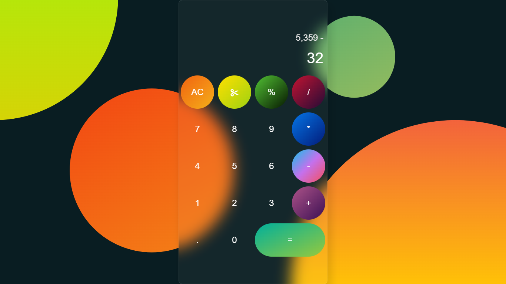

# Basic Calculator

  This is a basic Calculator app where we can perform basic mathematical operations. This app is accessed by both keyboard and mouse.
  
## Getting Started with vite

this project was boot@starpped with [vite](https://vitejs.dev/)
## Tech Used
Client: HTML, CSS, JAVASCRIPT

## Demo
# [Live Demo](https://basic-calculator-bishtsaurabh60.netlify.app/)



## Run Locally

Clone the project

```bash
  git clone https://github.com/bishtsaurabh60/Basic_calculator.git
```

Go to the project directory

```bash
  cd Basic_calculator
```

Install dependencies

```bash
  npm install
```

Start the server

```bash
  npm run dev
```

